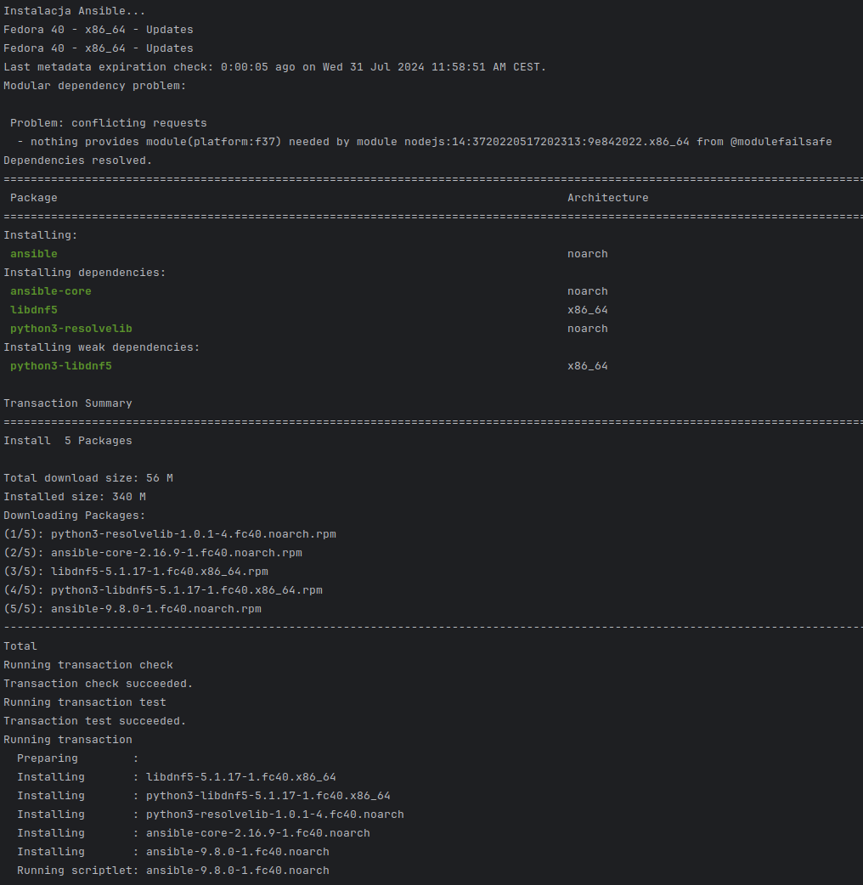
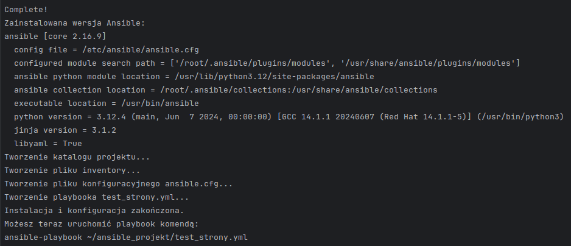
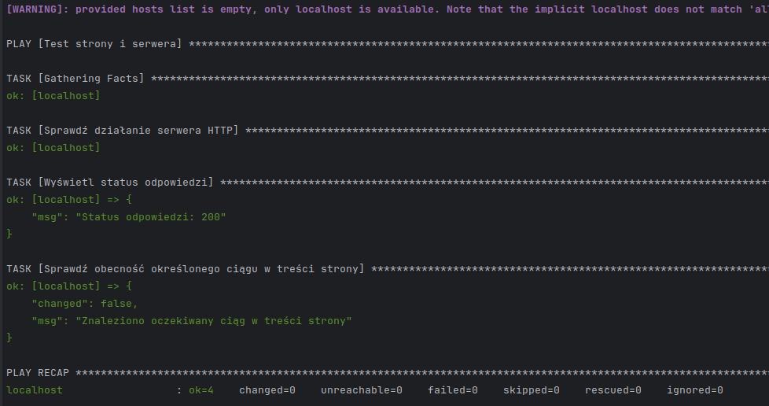

# ansible.moddevops.com

+ [ansible.moddevops.com](https://gansible.moddevops.com)
+ [mod-devops/ansible](https://github.com/mod-devops/ansible)

## Szybka instalacja i test z [install_ansible.sh](install_ansible.sh)


Skrypt w bashu, który automatyzuje proces instalacji Ansible i konfiguracji pierwszego projektu.
Ten skrypt wykona wszystkie wcześniej opisane kroki, włącznie z instalacją Ansible, utworzeniem struktury katalogów, plików konfiguracyjnych i playbooka testowego.

1. Zapisz go do pliku, na przykład [install_ansible.sh](install_ansible.sh)
2. Nadaj mu uprawnienia do wykonywania:
   ```bash
   chmod +x install_ansible.sh
   ```
3. Uruchom skrypt z uprawnieniami roota:
   ```bash
   sudo ./install_ansible.sh
   ```





Po zakończeniu działania skryptu, będziesz mógł uruchomić playbook testowy zgodnie z instrukcją wyświetloną na końcu.





4. Uruchomienie playbooka:

```bash
ansible-playbook test_strony.yml
```



---


## Opis Scenariusza instalacji
Oto krok po kroku instrukcja, jak zacząć z Ansible na Fedorze i stworzyć pierwszy test sprawdzenia działania strony i serwera:

1. Instalacja Ansible na Fedorze:

```bash
sudo dnf install ansible
```

2. Sprawdzenie wersji Ansible:

```bash
ansible --version
```

3. Stworzenie katalogu projektu:

```bash
mkdir ansible_projekt
cd ansible_projekt
```

4. Utworzenie pliku inventory:

```bash
echo "localhost ansible_connection=local" > inventory
```

5. Utworzenie pliku konfiguracyjnego ansible.cfg:

```bash
echo "[defaults]
inventory = inventory" > ansible.cfg
```

6. Stworzenie playbooka do testowania strony i serwera:

```bash
touch test_strony.yml
```

7. Edycja pliku test_strony.yml:

```yaml
---
- name: Test strony i serwera
  hosts: localhost
  tasks:
    - name: Sprawdź działanie serwera HTTP
      uri:
        url: http://example.com
        return_content: yes
      register: http_response

    - name: Wyświetl status odpowiedzi
      debug:
        msg: "Status odpowiedzi: {{ http_response.status }}"

    - name: Sprawdź obecność określonego ciągu w treści strony
      assert:
        that:
          - "'Example Domain' in http_response.content"
        fail_msg: "Nie znaleziono oczekiwanego ciągu w treści strony"
        success_msg: "Znaleziono oczekiwany ciąg w treści strony"
```

8. Uruchomienie playbooka:

```bash
ansible-playbook test_strony.yml
```

Ten przykład sprawdza dostępność strony example.com, wyświetla status odpowiedzi i sprawdza, czy w treści strony znajduje się określony ciąg.


----